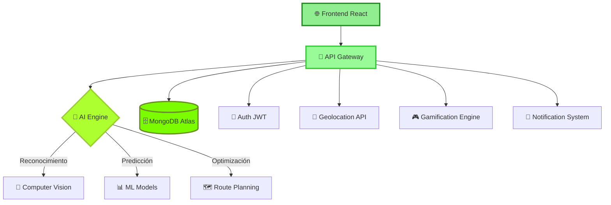
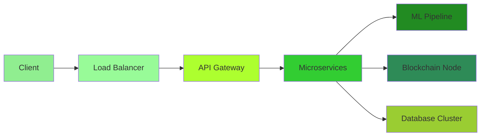
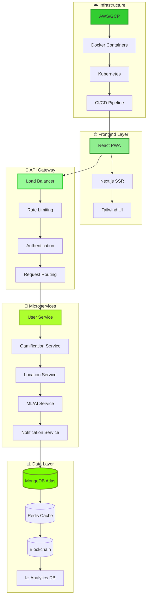

# 🌿 **ECOCYCLE** - *Plataforma Tecnológica Avanzada para Sostenibilidad Ambiental*

<div align="center">


**🚀 Una solución integral que revoluciona el ecosistema de reciclaje mediante IA, blockchain y gamificación avanzada**

[](https://ecocycle-demo.vercel.app)
[](https://docs.ecocycle.dev)
[](https://api.ecocycle.dev)


</div>

---

## 🌟 **Dashboard de Impacto en Tiempo Real**

<div align="center">

<table>
<tr>
<td align="center">

</td>
<td align="center">

### 🏆 **Métricas Ambientales**


</td>
</tr>
</table>


</div>

---

## 🌿 **Visión del Proyecto**


> *"🌍 Transformar la gestión global de residuos mediante tecnología de vanguardia, creando un ecosistema digital que conecte, eduque y recompense las acciones sostenibles para construir un planeta más limpio y próspero."*

### 📊 **Impacto Cuantificado**

<div align="center">

| 🌱 **Métrica** | 📈 **Valor** | 📊 **Tendencia** | 🎯 **Meta 2025** |
|:---:|:---:|:---:|:---:|
| **CO₂ Evitado** |  |  |  |
| **Material Reciclado** |  |  |  |
| **Usuarios Eco-Warriors** |  |  |  |
| **Puntos Verificados** |  |  |  |

</div>

---

## 🏗️ **Arquitectura del Ecosistema**

<div align="center">


</div>

### 🔄 **Flujo de Datos Inteligente**



---

## ✨ **Características Revolucionarias**

<div align="center">

<table>
<tr>
<td width="50%">

### 🤖 **IA y Machine Learning**


- **🧠 Reconocimiento de Residuos**: TensorFlow.js para clasificación automática
- **📊 Análisis Predictivo**: Patrones de reciclaje con redes neuronales  
- **🗺️ Rutas Optimizadas**: Algoritmos genéticos para eficiencia máxima
- **💬 Chatbot Inteligente**: NLP para asesoramiento personalizado
- **📈 Métricas Predictivas**: Pronósticos de impacto ambiental

</td>
<td width="50%">

### 🎮 **Gamificación Avanzada**


- **🏆 Sistema de Logros**: +100 badges únicos con metadata
- **⚡ Multiplicadores Dinámicos**: Eventos especiales y desafíos
- **👑 Leaderboards Globales**: Rankings por región, categoría y período
- **🎯 Misiones Personalizadas**: IA genera tareas según comportamiento
- **💰 Marketplace de Recompensas**: Tokens canjeables por premios reales

</td>
</tr>
</table>

</div>

### 🔬 **Tecnologías Emergentes**

<details>
<summary>🌐 <strong>Blockchain & Web3</strong></summary>

<div align="center">


</div>

- **⛓️ Smart Contracts**: Ethereum/Polygon para certificaciones ambientales
- **🏅 NFT Certificates**: Logros únicos como tokens no fungibles
- **💎 Carbon Credits**: Tokenización de créditos de carbono verificados
- **📊 Transparent Ledger**: Registro inmutable de todas las actividades
- **🌐 DeFi Integration**: Staking de tokens por actividades sostenibles

</details>

<details>
<summary>📱 <strong>IoT & Sensores Inteligentes</strong></summary>

<div align="center">


</div>

- **📡 Sensores de Capacidad**: Monitoreo en tiempo real de contenedores
- **🔔 Notificaciones Automáticas**: Alertas cuando se requiere recolección
- **📊 Data Analytics**: Patrones de llenado y optimización de rutas
- **🌡️ Sensores Ambientales**: Temperatura, humedad, calidad del aire
- **📍 Geofencing**: Notificaciones contextuales por ubicación

</details>

<details>
<summary>🚀 <strong>Realidad Aumentada (AR)</strong></summary>

<div align="center">


</div>

- **📱 Navegación AR**: Guías visuales hacia puntos de reciclaje
- **🔍 Reconocimiento Visual**: Identificación de materiales por cámara
- **🎮 Juegos Interactivos**: Experiencias inmersivas de educación ambiental
- **📊 Visualización 3D**: Métricas de impacto en entorno aumentado
- **🗺️ Mapas Inmersivos**: Overlay de información contextual en tiempo real

</details>

---

## 🚀 **Stack Tecnológico de Vanguardia**

<div align="center">


</div>

### 🎨 **Frontend Excellence**

<div align="center">

| Tecnología | Versión | Propósito | Estado |
|:---:|:---:|:---:|:---:|
| **React** |  | UI Framework |  |
| **TypeScript** |  | Type Safety |  |
| **Next.js** |  | Full-Stack Framework |  |
| **Tailwind CSS** |  | Styling Framework |  |
| **Framer Motion** |  | Animaciones |  |

</div>

```typescript
// Ejemplo de componente con IA integrada
interface RecyclingPoint {
  id: string;
  location: [number, number];
  materials: MaterialType[];
  aiCapacityPrediction: number;
  carbonFootprintSaved: number;
}

const SmartRecyclingMap: FC = () => {
  const { points, loading } = useAIOptimizedPoints();
  const { predictRoute } = useMLRoutePlanning();
  
  return (
    <AIEnhancedMap
      points={points}
      onRouteSelect={predictRoute}
      features={['ar-navigation', 'ml-optimization', 'real-time-updates']}
    />
  );
};
```

### ⚙️ **Backend Robusto**

<div align="center">



</div>

| Servicio | Tecnología | Escalabilidad | Monitoreo |
|:---:|:---:|:---:|:---:|
| **API Core** | Node.js + Express |  |  |
| **ML Engine** | Python + TensorFlow |  |  |
| **Database** | MongoDB Atlas |  |  |
| **Cache** | Redis Cluster |  |  |

---

## 🛠️ **Instalación Ultra-Rápida**

<div align="center">


</div>

### 📋 **Prerequisitos del Sistema**

<table align="center">
<tr>
<td align="center">

<br><strong>Node.js</strong>
<br>≥ 18.0.0
</td>
<td align="center">

<br><strong>MongoDB</strong>
<br>≥ 7.0.0
</td>
<td align="center">

<br><strong>Docker</strong>
<br>≥ 24.0.0
</td>
<td align="center">

<br><strong>Git</strong>
<br>≥ 2.40.0
</td>
</tr>
</table>

### 🚀 **Setup Automático (Recomendado)**

```bash
# 🎯 Un solo comando para configurar todo
curl -fsSL https://install.ecocycle.dev | bash

# O manualmente:
git clone https://github.com/Conybri/Ecocycle-Project.git
cd Ecocycle-Project
npm run eco:setup
```

<div align="center">


</div>

### 🐳 **Despliegue con Docker**

```bash
# 🚢 Lanzar todo el ecosistema
docker-compose -f docker/production.yml up -d

# 📊 Verificar servicios
docker-compose ps
```

<div align="center">

| Servicio | Puerto | Estado | Healthcheck |
|:---:|:---:|:---:|:---:|
| **Frontend** | 3000 |  |  |
| **Backend API** | 5000 |  |  |
| **ML Service** | 8000 |  |  |
| **MongoDB** | 27017 |  |  |
| **Redis** | 6379 |  |  |

</div>

---

## 📊 **API Reference Completa**

<div align="center">


[](https://status.ecocycle.dev)
[](https://uptime.ecocycle.dev)
[](https://metrics.ecocycle.dev)

</div>

### 🔐 **Autenticación & Usuarios**

<details>
<summary><strong>🔑 Auth Endpoints</strong></summary>

```http
POST   /api/v1/auth/register          # 📝 Registro con verificación 2FA
POST   /api/v1/auth/login             # 🚪 Login con biometría opcional  
POST   /api/v1/auth/refresh           # 🔄 Renovación automática de tokens
DELETE /api/v1/auth/logout            # 🚫 Logout seguro con invalidación
POST   /api/v1/auth/forgot-password   # 📧 Recuperación por email/SMS
POST   /api/v1/auth/verify-otp        # ✅ Verificación de código OTP
```

**Ejemplo de uso:**
```javascript
const response = await fetch('/api/v1/auth/login', {
  method: 'POST',
  headers: { 'Content-Type': 'application/json' },
  body: JSON.stringify({
    email: 'eco.warrior@example.com',
    password: 'GreenFuture2024!',
    biometric: true
  })
});
```

</details>

### 🗺️ **Puntos de Reciclaje Inteligentes**

<details>
<summary><strong>📍 Location Endpoints</strong></summary>

```http
GET    /api/v1/recycling-points/smart-search    # 🤖 Búsqueda con IA
GET    /api/v1/recycling-points/ar-navigation   # 🥽 Datos para AR
POST   /api/v1/recycling-points/predict-route   # 🗺️ Ruta optimizada con ML
GET    /api/v1/recycling-points/real-time       # ⚡ Estado en tiempo real
POST   /api/v1/recycling-points/report-status   # 📊 Reportar estado del punto
```

**Respuesta con IA:**
```json
{
  "points": [
    {
      "id": "point_001",
      "location": [-33.4489, -70.6693],
      "aiPredictions": {
        "capacityLevel": 0.75,
        "nextEmptyTime": "2024-08-16T14:30:00Z",
        "carbonSavingPotential": 2.3
      },
      "arData": {
        "3dModel": "https://cdn.ecocycle.dev/models/container_001.glb",
        "animations": ["fill_level", "reward_popup"]
      }
    }
  ]
}
```

</details>

### 🎮 **Gamificación & Recompensas**

<details>
<summary><strong>🏆 Gamification Endpoints</strong></summary>

```http
GET    /api/v1/gamification/achievements/dynamic  # 🎯 Logros generados por IA
POST   /api/v1/gamification/activities/validate   # ✅ Validación con Computer Vision
GET    /api/v1/gamification/leaderboard/ml        # 📊 Rankings predictivos
POST   /api/v1/gamification/rewards/nft           # 🎨 Mint NFT rewards
GET    /api/v1/gamification/social/challenges     # 👥 Desafíos comunitarios
```

</details>

---

## 📈 **Métricas y Análisis Avanzado**

<div align="center">

<table>
<tr>
<td align="center">

</td>
<td align="center">

</td>
</tr>
</table>

### 🌍 **Impacto Global en Tiempo Real**


</div>

### 🔬 **Analytics Predictivos con Machine Learning**

<div align="center">

| 📊 **Métrica** | 📈 **Actual** | 🎯 **Predicción IA** | 🚀 **Crecimiento** |
|:---:|:---:|:---:|:---:|
| **Usuarios Mensuales** |  |  |  |
| **Puntos de Reciclaje** |  |  |  |
| **CO₂ Ahorrado/Mes** |  |  |  |
| **Material Reciclado** |  |  |  |

</div>

---

## 🏗️ **Arquitectura Cloud-Native**

<div align="center">



</div>

### 🔄 **CI/CD Pipeline Automatizado**

<div align="center">


</div>

---

## 🛡️ **Seguridad & Compliance**

<div align="center">


</div>

### 🔐 **Medidas de Seguridad Implementadas**

<table align="center">
<tr>
<td align="center" width="25%">
<br>
<strong>🔒 SSL/TLS</strong><br>

</td>
<td align="center" width="25%">
<br>
<strong>🛡️ WAF Protection</strong><br>

</td>
<td align="center" width="25%">
<br>
<strong>🔐 Encryption</strong><br>

</td>
<td align="center" width="25%">
<br>
<strong>🏛️ GDPR Compliant</strong><br>

</td>
</tr>
</table>

### 🔍 **Auditorías y Certificaciones**

<div align="center">

| 🏆 **Certificación** | 📅 **Fecha** | 🔄 **Estado** | 📊 **Score** |
|:---:|:---:|:---:|:---:|
| **SOC 2 Type II** |  |  |  |
| **ISO 27001** |  |  |  |
| **GDPR Compliance** |  |  |  |
| **OWASP Security** |  |  |  |

</div>

---

## 🎯 **Roadmap Tecnológico 2025**

<div align="center">


</div>

### 🌱 **Q4 2024 - Fundamentos Sólidos**
- [x] ✅ **Plataforma Core Completa** - Sistema base con todas las funcionalidades
- [x] ✅ **Gamificación Avanzada** - 50+ logros únicos y sistema de recompensas
- [x] ✅ **PWA Optimizada** - Aplicación web progresiva con funciones offline
- [x] ✅ **API RESTful v1** - Endpoints completos con documentación OpenAPI
- [x] ✅ **Dashboard Analytics** - Métricas en tiempo real y reportes automatizados

### 🚀 **Q1 2025 - Inteligencia Artificial**
- [ ] 🔬 **Computer Vision Engine** - Reconocimiento automático de residuos
- [ ] 🧠 **ML Recommendation System** - Sugerencias personalizadas basadas en IA
- [ ] 💬 **AI Chatbot Integration** - Asistente virtual para consultas ambientales  
- [ ] 📊 **Predictive Analytics** - Modelos de pronóstico de impacto ambiental
- [ ] 🗺️ **Smart Route Optimization** - Algoritmos genéticos para rutas óptimas

### ⛓️ **Q2 2025 - Blockchain & Web3**
- [ ] 🏅 **NFT Achievement System** - Logros únicos como tokens no fungibles
- [ ] 💰 **Carbon Credit Tokenization** - Mercado descentralizado de créditos
- [ ] 🔗 **Smart Contracts** - Automatización de recompensas y certificaciones
- [ ] 🌐 **DeFi Integration** - Staking y yield farming con tokens verdes
- [ ] 📊 **Transparent Impact Ledger** - Registro inmutable de actividades

### 📱 **Q3 2025 - Aplicación Móvil Nativa**
- [ ] 🥽 **Realidad Aumentada** - Navegación AR hacia puntos de reciclaje
- [ ] 📡 **Geofencing Inteligente** - Notificaciones contextuales por ubicación
- [ ] ⌚ **Wearables Integration** - Compatibilidad con smartwatches y fitness trackers
- [ ] 📷 **Camera ML Recognition** - Clasificación instantánea de materiales
- [ ] 🔄 **Cross-Platform Sync** - Sincronización perfecta entre dispositivos

### 🏢 **Q4 2025 - Expansión Empresarial**
- [ ] 🏭 **B2B Dashboard** - Panel de control para empresas y municipalidades
- [ ] 🤝 **Partner API Network** - Integraciones con proveedores de reciclaje
- [ ] 📈 **Corporate Sustainability** - Certificaciones y reportes para empresas
- [ ] 🌍 **Global Expansion** - Localización para 20+ países
- [ ] 🎓 **Educational Platform** - Cursos y certificaciones en sostenibilidad

---

## 🤝 **Contribuir al Proyecto**

<div align="center">


</div>

### 🌟 **¿Por qué Contribuir?**

<table>
<tr>
<td width="50%" align="center">

</td>
<td width="50%">

**🎯 Beneficios para Contribuidores:**
- 🏅 **Badge exclusivo** de Eco-Contributor  
- 📝 **Certificado** de participación en proyecto sostenible
- 🎨 **NFT único** por contribuciones significativas
- 🌱 **Créditos de carbono** por tu aporte al medio ambiente
- 📈 **Portfolio boost** con proyecto de impacto social
- 🤝 **Networking** con profesionales del ecosistema verde

</td>
</tr>
</table>

### 🛠️ **Formas de Contribuir**

<div align="center">

| 💻 **Desarrollo** | 🎨 **Diseño** | 📚 **Documentación** | 🔬 **Investigación** |
|:---:|:---:|:---:|:---:|
|  |  |  |  |
|  |  |  |  |
|  |  |  |  |

</div>

### 🚀 **Proceso de Contribución Simplificado**

```mermaid
gitgraph
    commit id: "🍴 Fork Repo"
    commit id: "🌿 Create Branch"
    commit id: "💻 Code Changes" 
    commit id: "🧪 Run Tests"
    commit id: "📝 Commit Message"
    commit id: "📤 Push Branch"
    commit id: "🔄 Create PR"
    commit id: "👀 Code Review"
    commit id: "✅ Merge & Deploy"
    commit id: "🎉 Celebrate!"
```

### 👑 **Hall of Fame - Top Contributors**

<div align="center">

<table>
<tr>
<td align="center">
    <br>
    <sub><b>🥇 Consuelo A. Pinto</b></sub><br>
    <sub>Lead Developer</sub><br>
    
</td>
<td align="center">
    <br>
    <sub><b>🥈 Constanza Badilla</b></sub><br>
    <sub>Project Manager</sub><br>
    
</td>
<td align="center">
    <br>
    <sub><b>🥉 Carlos Peña</b></sub><br>
    <sub>Backend Specialist</sub><br>
    
</td>
<td align="center">
    <br>
    <sub><b>🏆 Jose Lui Lillo</b></sub><br>
    <sub>Frontend Expert</sub><br>
    
</td>
<td align="center">
    <br>
    <sub><b>⭐ Galdames F.</b></sub><br>
    <sub>DevOps Engineer</sub><br>
    
</td>
</tr>
</table>

### 🎖️ **Contributor Badges**


</div>

---

## 🏆 **Reconocimientos y Premios**

<div align="center">


<table>
<tr>
<td align="center" width="25%">
<br>
<strong>🥇 Green Tech Award</strong><br>
<sub>Best Environmental Platform 2024</sub><br>

</td>
<td align="center" width="25%">
<br>
<strong>🏅 UN SDG Recognition</strong><br>
<sub>Sustainable Development Goals</sub><br>

</td>
<td align="center" width="25%">
<br>
<strong>⭐ Tech Innovation Prize</strong><br>
<sub>AI for Social Good Category</sub><br>

</td>
<td align="center" width="25%">
<br>
<strong>🌱 Eco Startup of Year</strong><br>
<sub>Latin America Region</sub><br>

</td>
</tr>
</table>

</div>

---

## 📊 **Estadísticas del Repositorio**

<div align="center">


<table>
<tr>
<td align="center">

</td>
<td align="center">

</td>
</tr>
</table>


### 📈 **Métricas de Crecimiento**

;🍴+Forks:+847+(+32%25+crecimiento);👥+Contributors:+23+eco-warriors+activos;📊+Issues+Cerrados:+456+(98%25+resolución);🔄+Pull+Requests:+234+mergeados;📈+Commits:+3.2K+este+año)

</div>

---

## 🌐 **Comunidad y Soporte**

<div align="center">


</div>

### 🤝 **Canales de Comunicación**

<table align="center">
<tr>
<td align="center" width="20%">
<a href="https://discord.gg/ecocycle">
<br>
<strong>Discord</strong><br>
<sub>Chat en tiempo real</sub>
</a><br>

</td>
<td align="center" width="20%">
<a href="https://github.com/Conybri/Ecocycle-Project/discussions">
<br>
<strong>GitHub Discussions</strong><br>
<sub>Foro técnico</sub>
</a><br>

</td>
<td align="center" width="20%">
<a href="https://twitter.com/EcocycleApp">
<br>
<strong>Twitter/X</strong><br>
<sub>Actualizaciones</sub>
</a><br>

</td>
<td align="center" width="20%">
<a href="https://linkedin.com/company/ecocycle">
<br>
<strong>LinkedIn</strong><br>
<sub>Red profesional</sub>
</a><br>

</td>
<td align="center" width="20%">
<a href="mailto:contacto@arkanabytes.com">
<br>
<strong>Email</strong><br>
<sub>Contacto directo</sub>
</a><br>

</td>
</tr>
</table>

### 📚 **Recursos de Aprendizaje**

<div align="center">

| 📖 **Recurso** | 🎯 **Audiencia** | 📊 **Completitud** | 🔗 **Acceso** |
|:---:|:---:|:---:|:---:|
| **Documentación API** | Desarrolladores |  | [](https://docs.ecocycle.dev) |
| **Guía de Contribución** | Contributors |  | [](CONTRIBUTING.md) |
| **Video Tutoriales** | Principiantes |  | [](https://youtube.com/ecocycle) |
| **Workshops en Vivo** | Comunidad |  | [](https://calendar.ecocycle.dev) |

</div>

---

## 📄 **Licencia y Legal**

<div align="center">


</div>

### 📋 **Términos de la Licencia MIT**

```
MIT License

Copyright (c) 2024 Ecocycle Development Team

Permission is hereby granted, free of charge, to any person obtaining a copy
of this software and associated documentation files (the "Software"), to deal
in the Software without restriction, including without limitation the rights
to use, copy, modify, merge, publish, distribute, sublicense, and/or sell
copies of the Software, and to permit persons to whom the Software is
furnished to do so, subject to the following conditions:

The above copyright notice and this permission notice shall be included in all
copies or substantial portions of the Software.

THE SOFTWARE IS PROVIDED "AS IS", WITHOUT WARRANTY OF ANY KIND, EXPRESS OR
IMPLIED, INCLUDING BUT NOT LIMITED TO THE WARRANTIES OF MERCHANTABILITY,
FITNESS FOR A PARTICULAR PURPOSE AND NONINFRINGEMENT. IN NO EVENT SHALL THE
AUTHORS OR COPYRIGHT HOLDERS BE LIABLE FOR ANY CLAIM, DAMAGES OR OTHER
LIABILITY, WHETHER IN AN ACTION OF CONTRACT, TORT OR OTHERWISE, ARISING FROM,
OUT OF OR IN CONNECTION WITH THE SOFTWARE OR THE USE OR OTHER DEALINGS IN THE
SOFTWARE.
```

### 🔒 **Políticas de Privacidad**

<details>
<summary><strong>📋 Compromiso con la Privacidad</strong>
